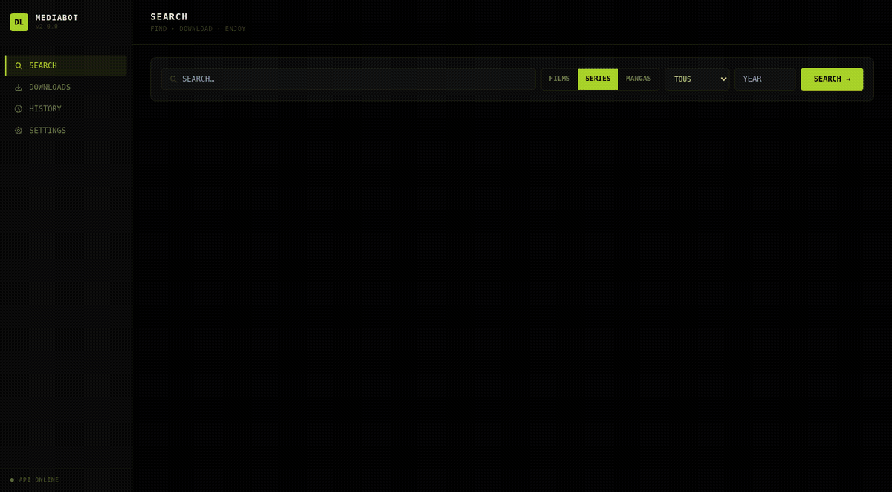
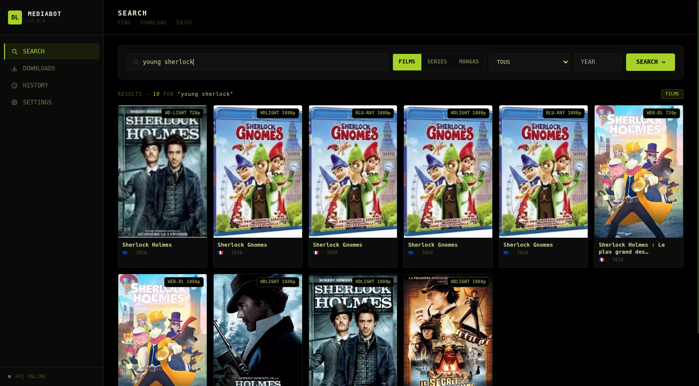
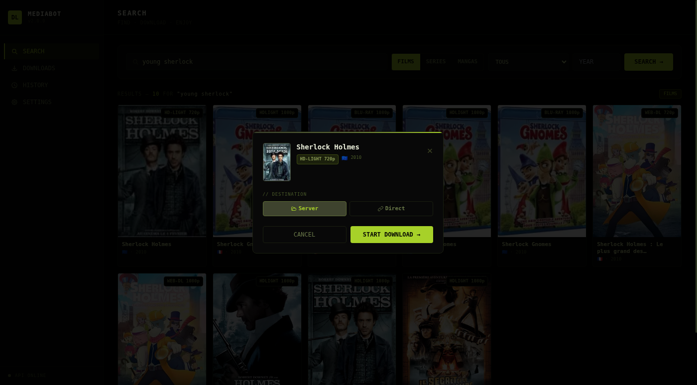
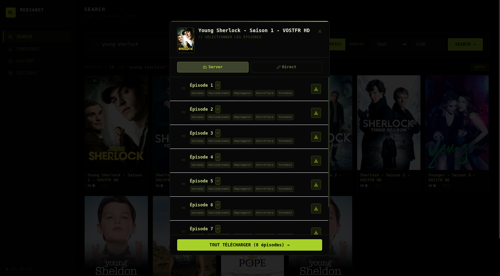
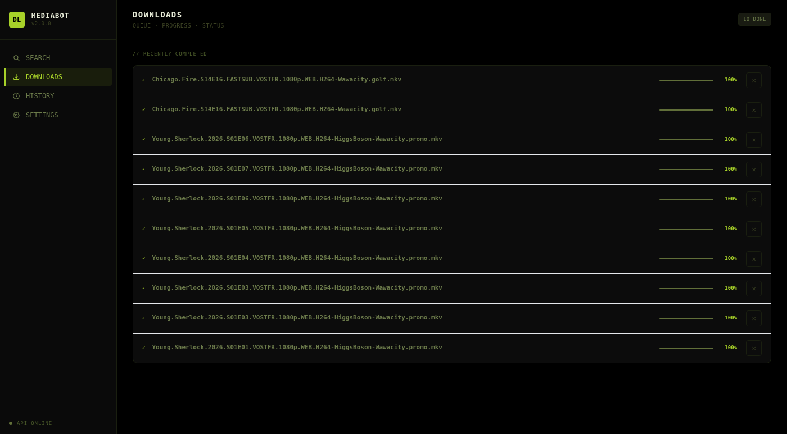
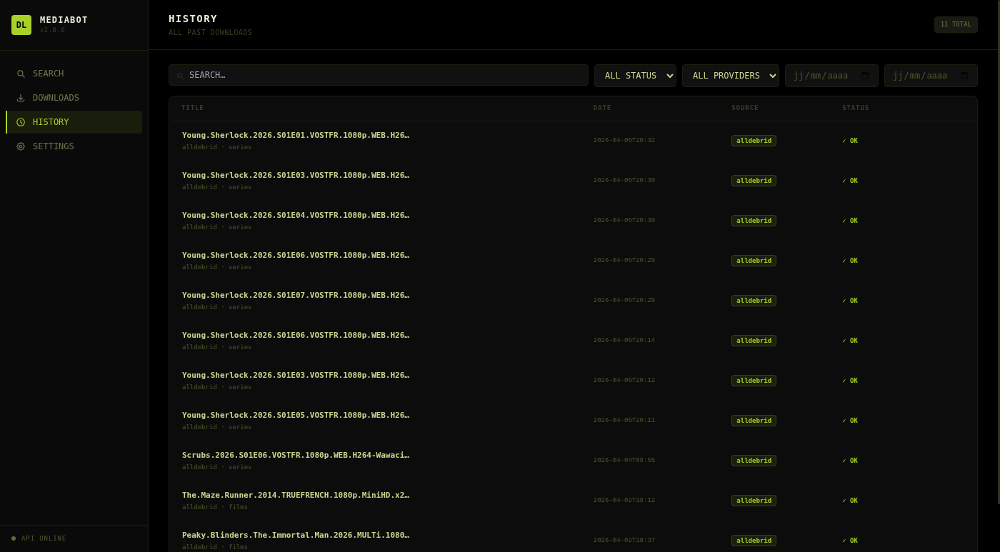
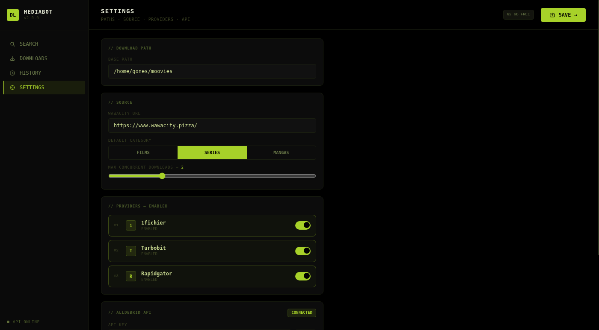

# dl_discord_bot v2


Application trois tiers pour rechercher et télécharger des films, séries et mangas
depuis **Wawacity**, **DarkiWorld** et **1337x** via **AllDebrid**.



<details>
<summary>📸 Screenshots</summary>

| Search | Modal téléchargement |
|---|---|
|  |  |

| Épisodes | Downloads |
|---|---|
|  |  |

| Historique | Paramètres |
|---|---|
|  |  |

</details>

```
dl_discord_bot/
├── backend/    FastAPI · SQLite · Alembic · aiohttp · Selenium
├── frontend/   Angular 21 · Tailwind CSS v3
└── bot/        Discord thin client → backend HTTP
```

---

## Démarrage rapide

### 1. Configuration

```bash
cp .env.example .env
# Remplir DISCORD_TOKEN, ALLDEBRID_API_KEY, DOWNLOAD_PATH, WAWACITY_URL
# Ajuster 1337X_URL si le miroir configuré ne répond plus
```

### 2. Développement local

```bash
# Backend (sert aussi le frontend buildé sur :8000)
cd backend && uv run uvicorn app.main:app --reload --port 8000

# Frontend (hot-reload dev uniquement)
cd frontend && npm ci && npm run start -- --port 4200

# Bot Discord
cd bot && uv run python main.py
```

> En dev, utilise `ng serve :4200` pour le hot-reload.  
> Le build Angular (`ng build`) est servi directement par FastAPI sur `:8000`.

### Note WSL / Windows

Si `npm` pointe vers l'installation Windows et échoue avec `node: not found`,
installe Node dans WSL ou utilise le runtime local de la workspace s'il est
présent :

```bash
export PATH="$PWD/.codex/runtime/node-v22.12.0-linux-x64/bin:$PATH"
cd frontend
npm ci
npm run build
```

### 3. Production (systemd)

```bash
bash deploy/install.sh
```

> Build le frontend Angular, applique les migrations, puis installe et démarre  
> `dl_backend.service` + `discord_bot.service`.  
> L'interface web est accessible sur **`http://<serveur>:8000`**.  
> Voir `deploy/` pour les fichiers unit.

---

## Variables d'environnement

| Variable | Description | Exemple |
|---|---|---|
| `DISCORD_TOKEN` | Token du bot Discord | `MTI...` |
| `DISCORD_GUILD` | ID du serveur Discord | `123456789` |
| `ALLDEBRID_API_KEY` | Clé API AllDebrid | `abc123` |
| `DOWNLOAD_PATH` | Répertoire de stockage | `/data/media` |
| `WAWACITY_URL` | URL de base Wawacity | `https://www.wawacity.city/` |
| `1337X_URL` | URL de base 1337x | `https://1337x.to` |
| `DARKIWORLD_URL` | URL de base DarkiWorld | `https://dd.darkiworld16.com` |
| `DARKIWORLD_EMAIL` | Email du compte DarkiWorld | `user@example.com` |
| `DARKIWORLD_PASSWORD` | Mot de passe du compte DarkiWorld | `***` |
| `DATABASE_URL` | SQLite async | `sqlite+aiosqlite:///./dl_bot.db` |
| `MAX_CONCURRENT_DOWNLOADS` | Téléchargements simultanés | `2` |
| `BACKEND_URL` | URL backend pour le bot | `http://localhost:8000` |

---

## API REST

| Méthode | Endpoint | Description |
|---|---|---|
| `GET` | `/api/v1/search` | Rechercher un titre |
| `POST` | `/api/v1/downloads` | Lancer un téléchargement |
| `GET` | `/api/v1/downloads` | Lister les téléchargements |
| `GET` | `/api/v1/downloads/{id}` | Détail d'un téléchargement |
| `DELETE` | `/api/v1/downloads/{id}` | Supprimer |
| `POST` | `/api/v1/downloads/{id}/retry` | Relancer un téléchargement en erreur |
| `GET` | `/api/v1/episodes` | Lister les épisodes d'une série |
| `GET` | `/api/v1/history` | Historique |
| `GET` | `/api/v1/favorites` | Favoris |
| `GET` | `/api/v1/status` | Santé du backend |
| `WS` | `/ws/downloads/{id}` | Progression temps réel |
| `WS` | `/ws/queue` | File d'attente temps réel |

---

## Tests

```bash
cd backend && uv run pytest
cd backend && uv run ruff check
```

---

## Commandes Discord

| Commande | Description |
|---|---|
| `!search <query> [films\|series\|mangas]` | Rechercher un titre |
| `!url <url>` | Télécharger depuis une URL directe |
| `!status` | Statut du backend + AllDebrid |

---

## Migrations BDD

```bash
cd backend
uv run alembic revision --autogenerate -m "description"
uv run alembic upgrade head
```

---

## Ajouter un scraper

Créer `backend/app/scrapers/<nom>.py` :

```python
from app.scrapers.base import BaseScraper, SearchResult, ProviderLinks, register

@register
class MonScraper(BaseScraper):
    source_name = "mon_source"

    async def search(self, query, category, year, limit) -> list[SearchResult]: ...
    async def get_provider_links(self, url, providers) -> list[ProviderLinks]: ...
```

Aucune autre modification nécessaire — le registre est automatique.

Sources actuelles : `wawacity`, `darkiworld` et `1337x`.

---

## Documentation

- [`docs/plan-v2.md`](docs/plan-v2.md) — Plan d'implémentation complet
- [`docs/architecture-v2.md`](docs/architecture-v2.md) — Diagrammes d'architecture
