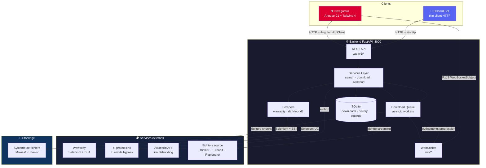
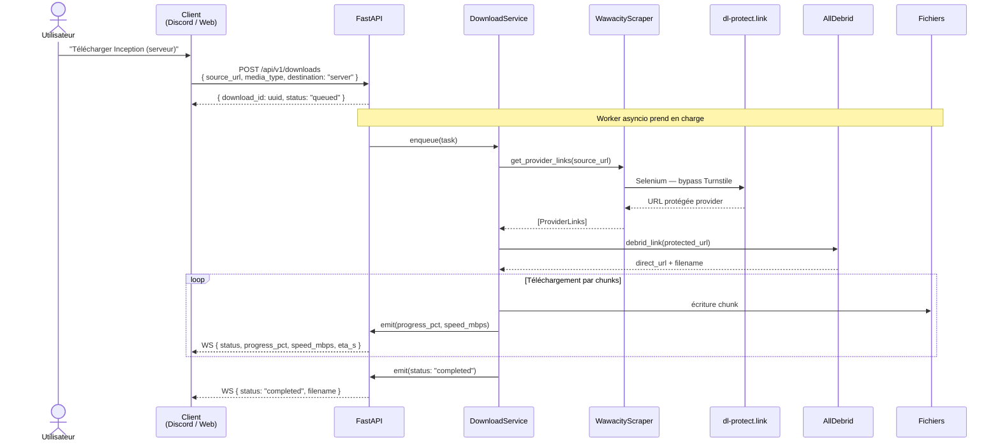
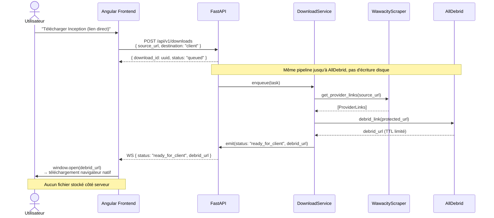
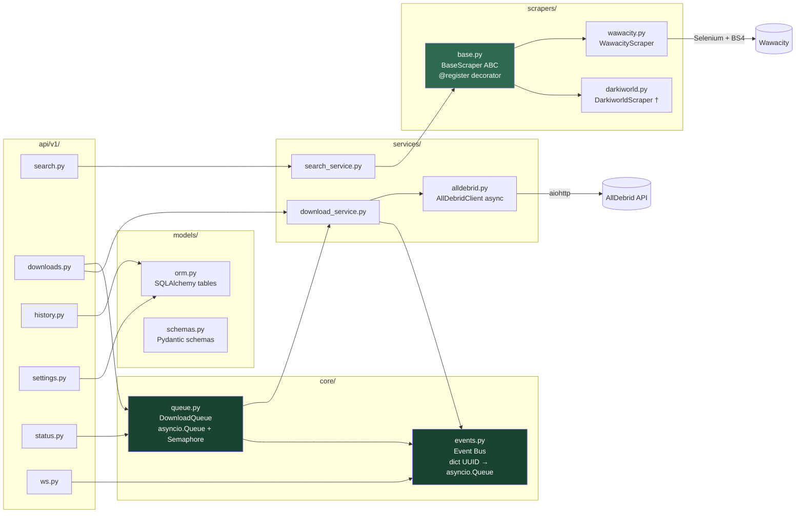
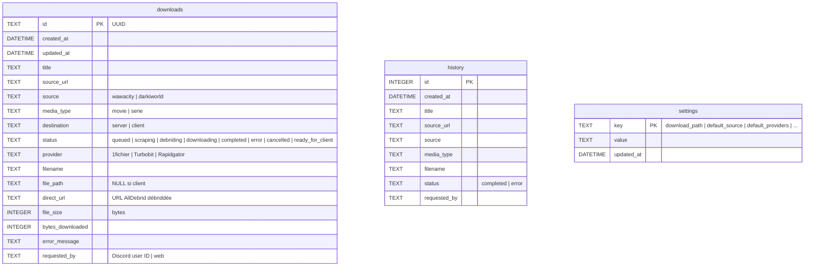
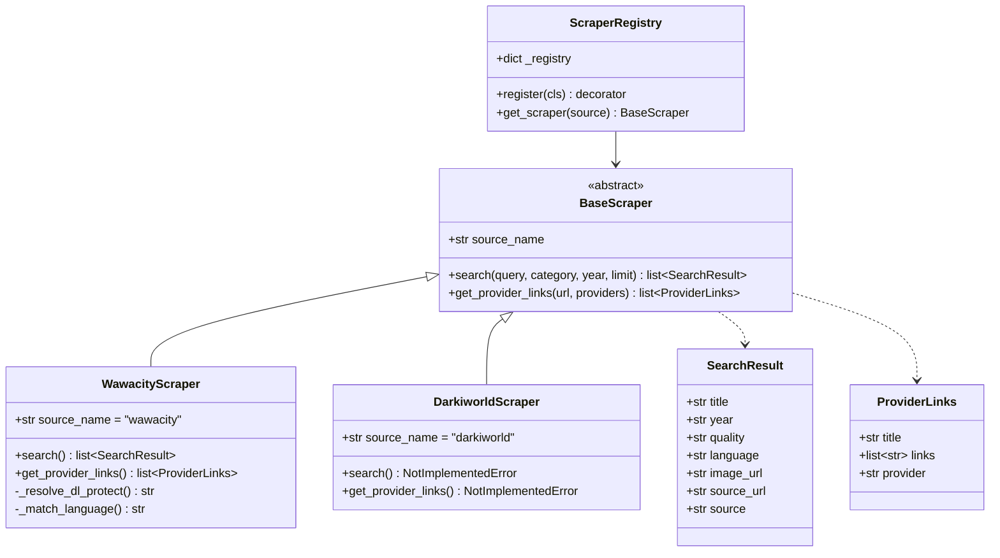
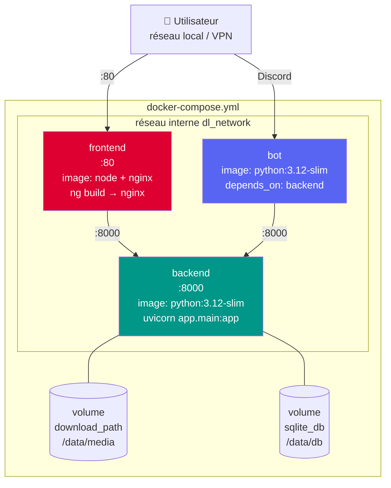

# Architecture v2 — dl_discord_bot

## 1. Vue d'ensemble du système



---

## 2. Flux de données — Téléchargement serveur



---

## 3. Flux de données — Téléchargement client (lien direct)



---

## 4. Architecture interne du Backend



---

## 5. Schéma de la base de données



---

## 6. Architecture des scrapers (plugin system)



---

## 7. Structure du monorepo

```
dl_discord_bot/                     ← monorepo racine
│
├── backend/                        ← FastAPI (Python)
│   ├── app/
│   │   ├── main.py                 ← factory + lifespan (démarrage workers)
│   │   ├── config.py               ← pydantic-settings
│   │   ├── database.py             ← SQLAlchemy async + aiosqlite
│   │   ├── api/v1/
│   │   │   ├── search.py           ← GET /api/v1/search
│   │   │   ├── downloads.py        ← POST/GET/DELETE /api/v1/downloads
│   │   │   ├── history.py          ← GET/DELETE /api/v1/history
│   │   │   ├── settings.py         ← GET/PUT /api/v1/settings
│   │   │   ├── status.py           ← GET /api/v1/status
│   │   │   └── ws.py               ← WS /ws/downloads/{id} + /ws/queue
│   │   ├── core/
│   │   │   ├── queue.py            ← DownloadQueue (asyncio.Queue + Semaphore)
│   │   │   └── events.py           ← Event bus (dict UUID → asyncio.Queue)
│   │   ├── scrapers/
│   │   │   ├── base.py             ← BaseScraper ABC + @register + get_scraper()
│   │   │   ├── wawacity.py         ← ← migration parser.py
│   │   │   └── darkiworld.py       ← stub NotImplementedError
│   │   ├── services/
│   │   │   ├── search_service.py   ← orchestre scraper
│   │   │   ├── download_service.py ← debrid + download + progression
│   │   │   └── alldebrid.py        ← ← migration alldebrid.py (async)
│   │   └── models/
│   │       ├── orm.py              ← tables SQLAlchemy
│   │       └── schemas.py          ← Pydantic request/response
│   ├── alembic/                    ← migrations BDD
│   ├── scripts/
│   │   └── migrate_csv.py          ← import history.csv → SQLite
│   └── pyproject.toml
│
├── bot/                            ← Discord Bot (Python)
│   ├── main.py                     ← entry point
│   ├── client.py                   ← BackendClient (aiohttp wrapper)
│   ├── cogs/
│   │   ├── search.py               ← !search → GET /api/v1/search
│   │   └── download.py             ← !url, !status → POST /api/v1/downloads
│   └── pyproject.toml              ← sans selenium/pandas/beautifulsoup4
│
├── frontend/                       ← Angular 21 + Tailwind CSS v3
│   ├── src/app/
│   │   ├── core/
│   │   │   ├── models/
│   │   │   │   └── api.models.ts   ← interfaces TypeScript partagées
│   │   │   └── services/
│   │   │       ├── api.service.ts  ← HttpClient → :8000/api/v1
│   │   │       └── ws.service.ts   ← RxJS WebSocketSubject → :8000/ws
│   │   ├── features/               ← lazy-loaded via loadChildren
│   │   │   ├── search/             ← rxResource search + modal téléchargement
│   │   │   ├── downloads/          ← linkedSignal + WS patch en temps réel
│   │   │   ├── history/            ← params signal + pagination
│   │   │   └── settings/           ← linkedSignal par champ initialisé depuis API
│   │   └── shared/
│   │       └── components/
│   │           └── sidebar/        ← rxResource status + polling 10s
│   └── package.json
│
├── docs/
│   └── architecture-v2.md          ← ce fichier
├── docker-compose.yml
└── .env.example
```

---

## 8. Déploiement Docker



> † Darkiworld : stub prévu en Phase 4, implémentation future
