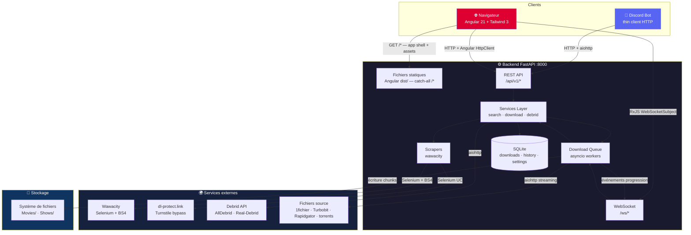
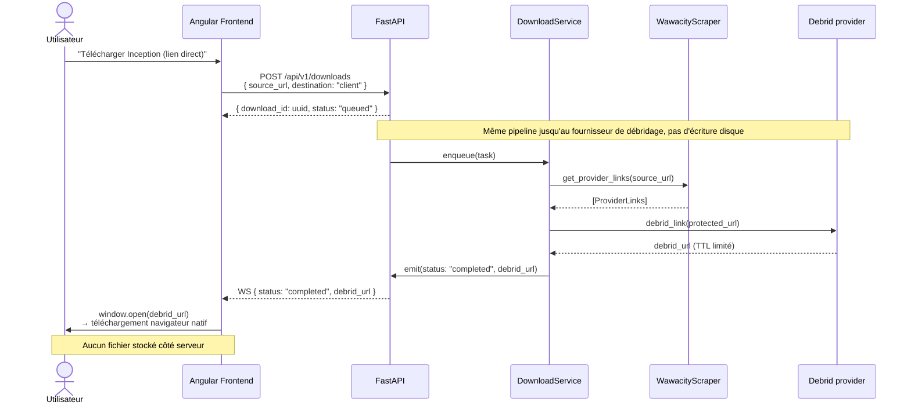
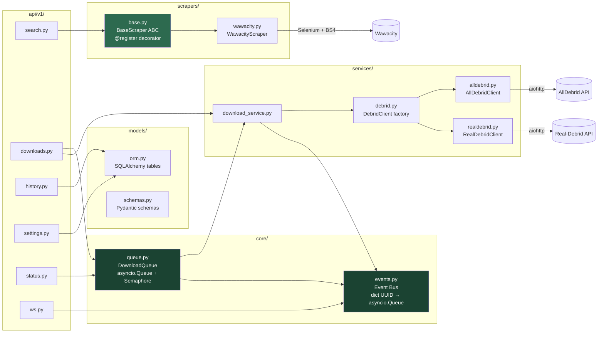
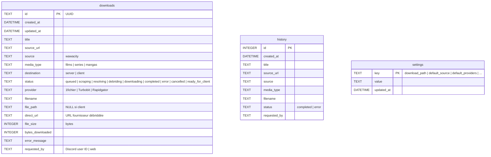
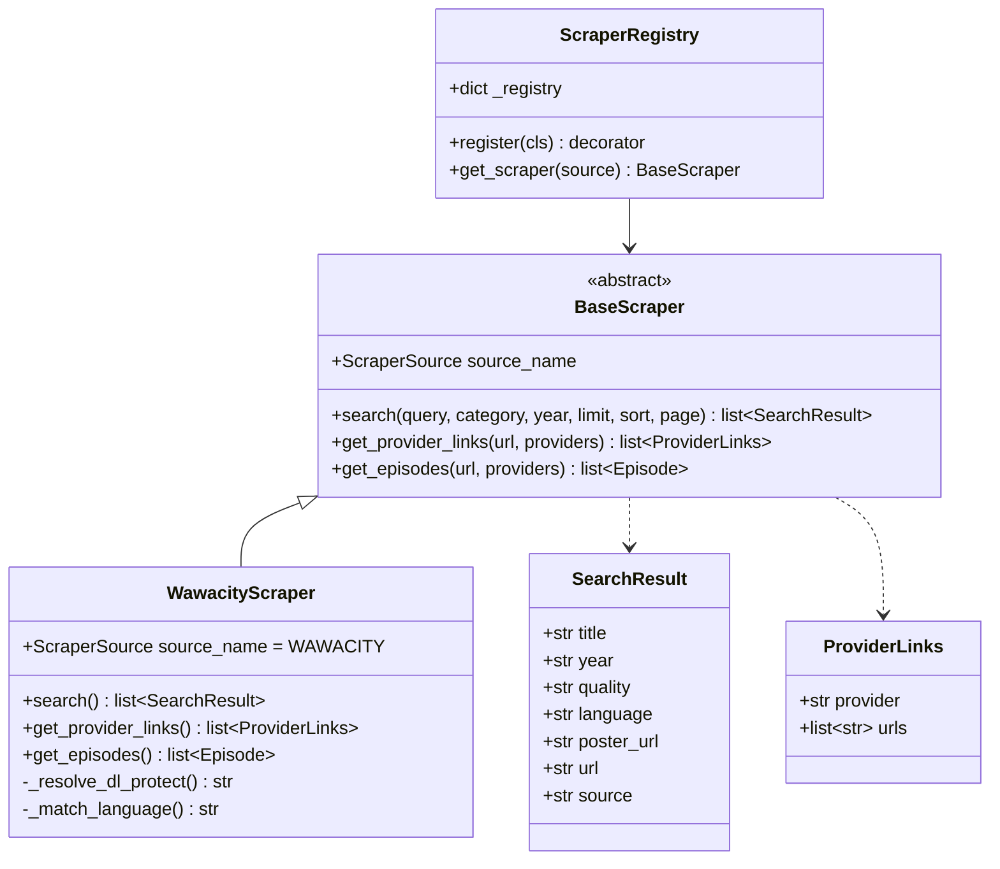
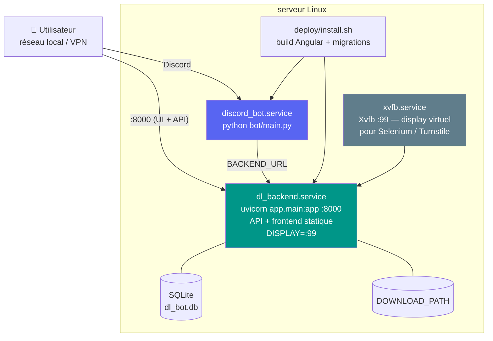

# Architecture v2 — DLux

## 1. Vue d'ensemble du système



---

## 2. Flux de données — Téléchargement serveur


---

## 3. Flux de données — Téléchargement client (lien direct)



---

## 4. Architecture interne du Backend



---

## 5. Schéma de la base de données



---

## 6. Contrat des valeurs métier

Les chaînes persistées restent des colonnes SQLite `TEXT`. Les valeurs API sont
centralisées par `backend/app/models/domain.py` et reprises par les types
TypeScript du frontend.

| Champ | Valeurs canoniques |
|---|---|
| `media_type` | `films`, `series`, `mangas` |
| `status` téléchargement | `queued`, `scraping`, `resolving`, `debriding`, `downloading`, `completed`, `error`, `cancelled` |
| `source` scraper | `wawacity` |
| fournisseur debrid | `alldebrid`, `realdebrid` |

`film`, `movie`, `serie` et `manga` restent acceptés à l'entrée puis sont
normalisés. `unknown` reste réservé à l'historique CSV importé. Le statut
`ready_for_client` reste lisible et supprimable pour compatibilité, mais les
téléchargements client actuels émettent `completed`.

---

## 7. Architecture des scrapers (plugin system)



---

## 8. Structure du monorepo

```
dlux/                               ← monorepo racine
│
├── backend/                        ← FastAPI (Python)
│   ├── app/
│   │   ├── main.py                 ← factory + lifespan (démarrage workers)
│   │   ├── config.py               ← pydantic-settings
│   │   ├── database.py             ← SQLAlchemy async + aiosqlite
│   │   ├── api/v1/
│   │   │   ├── search.py           ← GET /api/v1/search
│   │   │   ├── episodes.py         ← GET /api/v1/episodes
│   │   │   ├── favorites.py        ← GET/POST/DELETE /api/v1/favorites
│   │   │   ├── downloads.py        ← POST/GET/DELETE /api/v1/downloads
│   │   │   ├── history.py          ← GET/DELETE /api/v1/history
│   │   │   ├── settings.py         ← GET/PUT /api/v1/settings
│   │   │   ├── status.py           ← GET /api/v1/status
│   │   ├── api/
│   │   │   └── ws.py               ← WS /ws/downloads/{id} + /ws/queue
│   │   ├── core/
│   │   │   ├── queue.py            ← DownloadQueue (asyncio.Queue + Semaphore)
│   │   │   └── events.py           ← Event bus (dict UUID → asyncio.Queue)
│   │   ├── scrapers/
│   │   │   ├── base.py             ← BaseScraper ABC + @register + get_scraper()
│   │   │   └── wawacity.py
│   │   ├── services/
│   │   │   ├── download_service.py ← debrid + download + progression
│   │   │   └── alldebrid.py        ← ← migration alldebrid.py (async)
│   │   └── models/
│   │       ├── domain.py           ← enums métier partagés
│   │       ├── orm.py              ← tables SQLAlchemy
│   │       └── schemas.py          ← Pydantic request/response
│   ├── alembic/                    ← migrations BDD
│   ├── scripts/
│   │   └── migrate_csv.py          ← import history.csv → SQLite
│   └── pyproject.toml
│
├── bot/                            ← Discord Bot (Python)
│   ├── main.py                     ← entry point
│   ├── client.py                   ← BackendClient (aiohttp wrapper)
│   ├── domain.py                   ← valeurs API consommées par le bot
│   ├── cogs/
│   │   ├── search.py               ← !search → GET /api/v1/search
│   │   └── download.py             ← !url, !status → POST /api/v1/downloads
│   └── pyproject.toml              ← sans selenium/pandas/beautifulsoup4
│
├── frontend/                       ← Angular 21 + Tailwind CSS v3
│   ├── src/app/
│   │   ├── core/
│   │   │   ├── models/
│   │   │   │   ├── search.type.ts  ← interfaces TypeScript partagées
│   │   │   │   ├── download.type.ts
│   │   │   │   ├── source.type.ts  ← sources scraper/debrid
│   │   │   │   └── index.ts
│   │   │   └── services/
│   │   │       ├── api.service.ts  ← HttpClient → /api/v1 (même origin)
│   │   │       └── ws.service.ts   ← RxJS WebSocketSubject → /ws
│   │   ├── features/               ← lazy-loaded via loadChildren
│   │   │   ├── search/             ← recherche + modal téléchargement
│   │   │   ├── downloads/          ← liste active + WS temps réel
│   │   │   ├── history/            ← params signal + pagination
│   │   │   └── settings/           ← linkedSignal par champ initialisé depuis API
│   │   └── shared/
│   │       └── components/
│   │           └── sidebar/        ← rxResource status + polling 10s
│   ├── dist/frontend/browser/      ← build prod (ng build) servi par FastAPI
│   └── package.json
│
├── docs/
│   └── architecture-v2.md          ← ce fichier
├── deploy/                         ← services systemd + install.sh
└── .env.example
```

---

## 9. Déploiement actuel : systemd



Docker Compose est encore à faire et suivi par l'issue #44.
